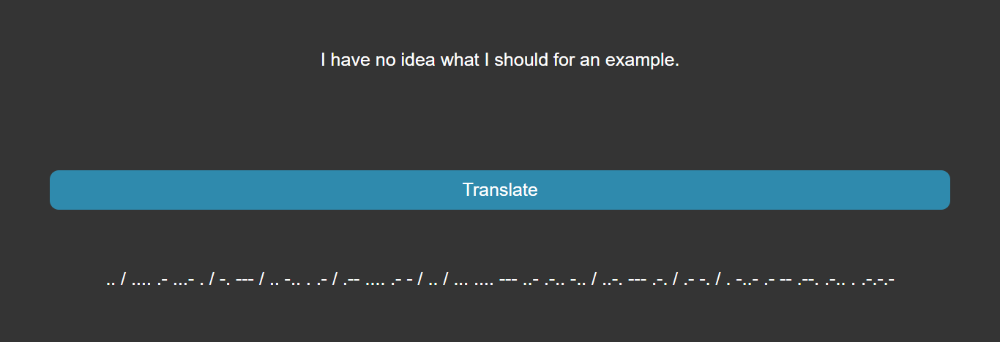
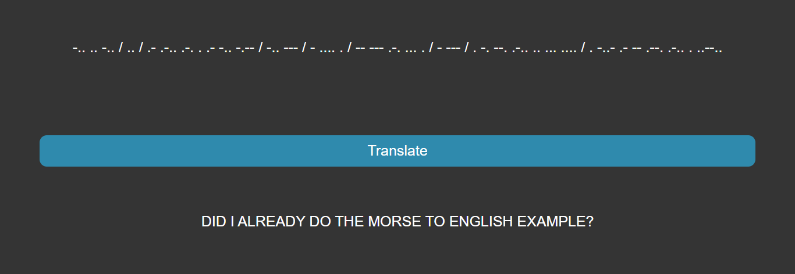

# Morse Code Translator

### This project was a TDD excersise and the function for translation was tested.

This Morse Code translator has been programmed to enable the user to enter either English or Morse and then translate it to other language.

... --- -- -.. . -... --- -.. -.-- / .- ... -.- . -.. / -- . / .-- .... .- - / .-. . .--. .-. . ... . -. - ... / ... / .. -. / -- --- .-. ... . / -.-. --- -.. . .-.-.- / .. / ... .- .. -.. / .-.-.- .-.-.- .-.-.-

# 	:fax: Morse Code Translator

This project used the TDD (Test Driven Development) approach. This meant all code was based upon tests that were built so the code could run and translate whatever the use would input. This means in the same field the user could write morse code and it will translate to english and vice versa. This also meant the library for english to morse was only needed rather than having two opposite libraries.

### :computer: Technologies used:

- HTML
- CSS/SCSS
- JavaScript

### :pencil: Methods:

TDD tests can be viewed [here](https://github.com/atif298/Morse-Code-Translator/blob/master/translator.spec.js)
This allowed for a more efficient approach to program the application to avoid as many bugs as possible.

### :heavy_check_mark: Features:

Here is an example of a English to morse code translation.

Now a morse code to English translation.

[Back to Profile](https://github.com/atif298)